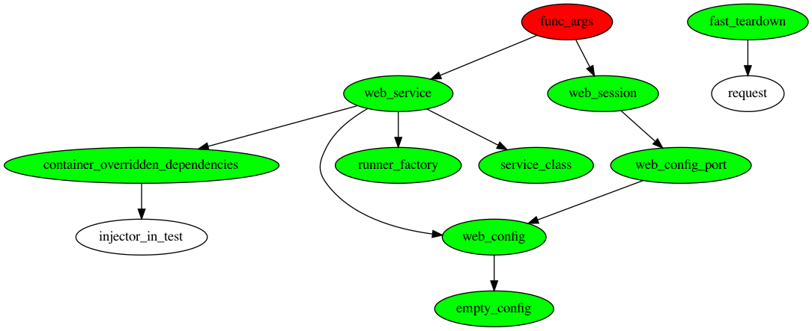

nameko-injector
===============

`injector <https://pypi.org/project/injector/>`_ based dependency injection
mechanism for nameko services. Project is similar to `flask-injector <https://pypi.org/project/Flask-Injector/>`_.

Problem
-------

Nameko provides a dependency injection mechanism, built-in in the framework.
It works in many cases with the limitations:

1. All the dependencies are injected regardless of whether they are used in the entry-point. For instance, all the dependencies will be injected for ``/health`` HTTP entry point.
2. Dependencies cannot depend on each other.
3. The scope is an implementation detail. Frequency of the dependency creation depends on the ``DependencyProvider`` implementation.
4. Subjectively, implementing a new ``DependencyProvider`` is not the easiest
   the task for the developers.

Solution
--------

The library provides an alternative dependency injection mechanism to the one
that is built-in in nameko. Several types of `request` scope can
be used out of the box without special injector module declarations.

- ``from nameko.containers.ServiceContainer``
- ``from nameko.containers.WorkerContext``
- ``werkzeug.wrappers.Request``, in case of HTTP requests

The library provides 2 **scopes**:

- ``nameko_injector.core.request_scope`` where each request has own instance of
  the injected type.
- ``nameko_injected.core.resource_request_scope`` it's like ``request_scope``
  but also ``close`` method is called on each injected value after the request
  is processed to free the resources on ``DependencyProvider.worker_teardown`` call.

An example of the test that declares service class and configuration provider:

.. code:: python

    import json
    import typing as t

    import injector
    import pytest
    from nameko.containers import ServiceContainer
    from nameko.web.handlers import http
    from nameko_injector.core import NamekoInjector

    class ServiceConfig:
        value: t.Mapping

    @injector.provider
    def provide_service_config(container: ServiceContainer) -> ServiceConfig:
        return container.config

    def configure(binder):
        binder.bind(
            ServiceConfig,
            to=provide_service_config,
            scope=injector.singleton,
        )

    INJECTOR = NamekoInjector(configure)

    @INJECTOR.decorate_service
    class Service:

        name = "service-name"

        @http("GET", "/config")
        def view_config(self, request, config: ServiceConfig):
            # 'config' is injected as singleton in each request that specifies it's type in
            # the view function's signature.
            return json.dumps(config)

Testing with library (pytest)
-----------------------------
The library provides a plugin for pytest with some basic fixtures.
To enable the plugin, add the following line in your ``conftest.py`` module.

.. code:: python

  pytest_plugins = [
      "nameko_injector.testing.pytest_fixtures",
  ]

Graph of fixtures generated from the test

.. code:: bash

   pytest --fixture-graph tests/test_http.py::test_http_request_injected

There are several fixtures that help during the testing. All of the fixtures
have ``function`` pytest scope.

- ``service_class`` fixture that **MUST** be redefined and return a service class under the test.

- ``web_service`` fixture starts a real HTTP server to make real HTTP requests to the service. It can be used together with nameko's fixture ``web_session`` that injects HTTP client that knows a correct port. See ``tests/test_injected.py`` as an example.

- ``injector_in_test`` fixture gives access to the ``injector.Injector`` instance that will resolve the dependencies in the instance of ``service_class``.
  The fixture uses a child injector from the one that decorates the service that provides isolation between the test cases with the same class under the test.
  By default, it uses ``worker_context`` fixture.

- ``container_overridden_dependencies`` - ``web_service`` uses this mapping of
  nameko dependencies that need to be overridden with the instance values.

- ``worker_ctx`` fixture is used to get ``injector_in_test`` value but it's a mock
  and might be redefined in your tests.

How to redefine dependency?
~~~~~~~~~~~~~~~~~~~~~~~~~~~
Let's assume that service depends on an HTTP client for some 3rd-party service.
In our test, we would like to use a mocked version of it. In that case, we need to
redefine ``injector_in_test`` fixture.

.. code:: python

  @pytest.fixture
  def injector_in_test(injector_in_test, mocked_http_client):
      injector_in_test.binder.bind(ThirdPartyServiceHttpClient, to=mocked_http_client)
      # injector_in_test.binder.install(MockedClientModule())
      return injector_in_test

Sophisticated cases
~~~~~~~~~~~~~~~~~~~
In more *sophisticated* cases when we redefine how the server is started with
``runner_factories`` main task is to ensure that the container (service instance
basically) has a valid injector. See
``nameko_injector/testing/pytest_fixtures.py:web_service`` code as an example.
Main line there is ``replace_dependencies(container, **container_overridden_dependencies)``.

Development
-----------
`tox`
